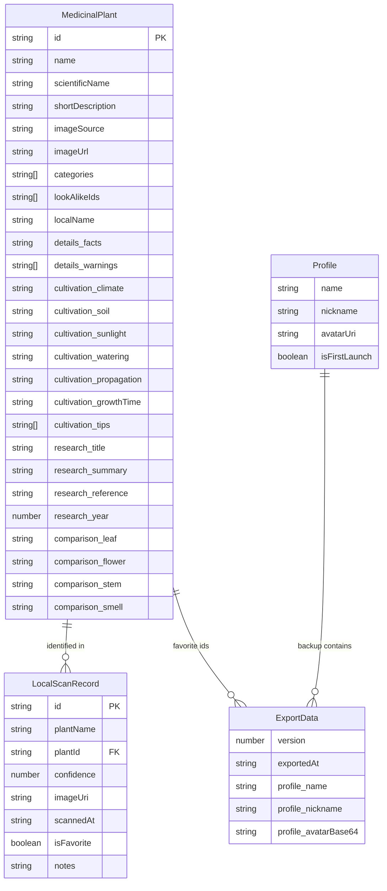

# ERD for hanap-medisina-offline

This ERD reflects the actual app data model from `src/types/index.ts`, `src/store/useHistoryStore.ts`, `src/store/useLibraryStore.ts`, `src/store/useProfileStore.ts`, and `src/services/dataTransfer.ts`.

## Notes

- `MedicinalPlant` is the canonical offline plant record loaded from `src/data/plants.json`.
- `LocalScanRecord` stores user scan history and references plants by `plantId`.
- `Profile` stores local user preferences and avatar data.
- `ExportData` is a backup payload containing `profile`, `scans`, and `favorites`.
- Favorites are persisted in code as full `MedicinalPlant[]` in `useLibraryStore`, but exported as `string[]` of plant IDs.
